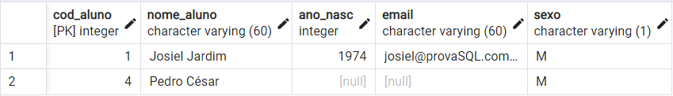
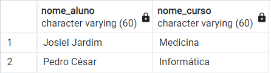
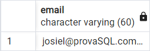
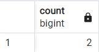
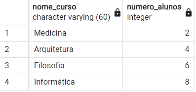
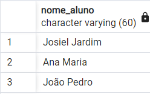
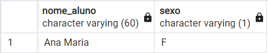
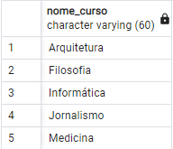

# Criação das Tabelas

## Tabela de Aluno
```sql
create table tb_aluno (
cod_aluno int primary key,
nome_aluno varchar(60) not null,
ano_nasc int,
email varchar(60),
sexo varchar(1) not null
)
```

## Tabela de Curso
```sql
create table tb_curso(
cod_curso int primary key,
nome_curso varchar(60) not null
)
```

## Tabela de Matricula
```sql
create table tb_matricula(
cod_curso int references tb_curso(cod_curso),
cod_aluno int references tb_aluno(cod_aluno)
)
```

# Inserção dos dados da Tabela

## Inserção dos dados dos alunos
```sql
insert into tb_aluno(cod_aluno,nome_aluno,ano_nasc,email,sexo)
values(1, 'Josiel Jardim', '1974','josiel@provaSQL.com.br','M');
values(2, 'Ana Maria', '1980','ana@provaSQL.com.br','F');
values(3, 'João Pedro', '1979','joao@provaSQL.com.br','M');
```
## Inserção dos dados do curso
```sql
insert into tb_curso(cod_curso, nome_curso)
values(1, 'Medicina')
values(2, 'Arquitetura')
values(3, 'Filosofia')
values(4, 'Informática')
values(5, 'Jornalismo')

```
## Inserção dos dados das matrículas
```sql
insert into tb_matricula(cod_curso, cod_aluno)
values(1, 1)
values(1, 2)
values(2, 3)
values(5, 3)
```


# Resolução da Prova Prática Banco de Dados - Parte Prática

## 1ª Questão
Faça um comando SQL para matricular o aluno “Pedro César” no curso de
Informática. Os dados devem ser inseridos na tabela TB_MATRÍCULA.

```sql
insert into tb_aluno(cod_aluno,nome_aluno,ano_nasc,email,sexo)
values(4, 'Pedro César', NULL, null,'M');
insert into tb_matricula(cod_curso, cod_aluno)
values(4, 4)
```
```sql
insert into tb_aluno(cod_aluno,nome_aluno,ano_nasc,email,sexo)
values(4, 'Pedro César', NULL, null,'M');
insert into tb_matricula(cod_curso, cod_aluno)
values(4, 4)
```

## Resultado esperado



## 2ª Questão
Escreva um comando SQL que retorne os nomes dos alunos e do(s) cursos em
que estão matriculados. Os dados deverão estar ordenados pelo nome do curso.

```sql
select tb_aluno.nome_aluno, tb_curso.nome_curso
FROM tb_aluno
INNER JOIN tb_matricula
ON tb_aluno.cod_aluno = tb_matricula.cod_aluno
INNER JOIN tb_curso
ON tb_curso.cod_curso = tb_matricula.cod_curso
```
## Resultado esperado



## 3ª Questão
Crie um comando SQL que retorne o e-mail de todos os alunos maiores de idade.

```sql
select email
from tb_aluno where 2022 - ano_nasc >= 18
```

## Resultado esperado



## 4ª Questão
Desenvolva um comando SQL que mostre o total de alunos.

```sql
select count(cod_aluno)
from tb_aluno
```
## Resultado esperado



## 5ª Questão
Escreva um comando SQL para listar o total de alunos matriculador em cada curso.

```sql
select tb_curso.nome_curso,
cod_curso + cod_aluno as numero_alunos
from tb_curso
inner join tb_aluno
on tb_aluno.cod_aluno = tb_curso.cod_curso
```
## Resultado esperado



## 6ª Questão
Desenvolva um comando SQL que retorne o nome de todos os alunos maiores que
18 anos.

```sql
select nome_aluno
from tb_aluno where 2022 - ano_nasc >= 18
```
## Resultado esperado



## 7ª Questão
Faça um comando SQL que retorne o nome de todas as mulheres.

```sql
select nome_aluno,sexo
from tb_aluno where sexo = 'F'
```
## Resultado esperado



## 8ª Questão
Faça um comando SQL que retorne o nome de todas as mulheres matriculadas
no curso de Medicina.

```sql
select tb_aluno.nome_aluno, tb_curso.nome_curso
from tb_aluno inner join tb_curso
on tb_aluno.cod_aluno = tb_curso.cod_curso
where nome_curso = 'Medicina' and sexo = 'F'
```
## Resultado esperado


## 9ª Questão
Faça um comando SQL que retorne os nomes dos cursos ordenados por ordem
alfabética.

```sql
select nome_curso from tb_curso
order by nome_curso asc
```
## Resultado esperado



## 10ª Questão
Crie o enunciado de uma consulta SQL que utilize “junção” (com resposta).
### Enunciado
Faça um comando SQL que consulte o nome, nascimento e o curso do aluno. Depois junte as colunas e faça com que o resultado imprima masculinos e maiores que 18

```sql
select tb_aluno.nome_aluno,ano_nasc,sexo, tb_curso.nome_curso
from tb_aluno
inner join tb_curso
on tb_aluno.cod_aluno = tb_curso.cod_curso
where sexo = 'M' and 2022 - ano_nasc >= 18
```
## Resultado esperado


# Resolução da Prova Prática Banco de Dados - Parte Teórica

## 1ª Questão - Defina: SQL.
Resumidamente, é uma linguagem de programação para lidar com banco de dados relacional (baseado em tabelas). Foi criado para que vários desenvolvedores pudessem acessar e modificar dados de uma empresa. É o acrônimo para Structured Query Language, para acesso e manipulação de dados, principalmente para banco de dados relacionados.
 
 ## 2° Questão - Faça um relacionamento cronológico sobre SQL.
 O SQL desenvolvido no início dos anos 70 nos laboratórios da IBM, dentro do prjeto "System R", que tinha objetivo demostrar a viabilidade da implementação do modelo relacional proposto por E.F Codd, nome sequel, acrônimo para "Structured English Query Language". A linguagem é um grande padrão de banco de dados, ela é mais usada por sua simplicidade e facilidade de uso. É uma linguagem declarativa em oposição a outras linguagens procedurais. SQL tenha sido originalmente criado pela IBM, essa expansão de mercado levou a necessidade de ser criado e adaptado um padrão para a linguagem, fieita pela a American National Standards Institute (ANSI). Em 1992 o SQL foi feita uma atualização chamada SQL-92 com sua nova versão, e depois lançado novamento outra versão nos anos de 1999 e 2003 com SQL3 e SQL:1999, usando expressões regulares de emparelhamento e queries recursivas e gatilhos para o inglês "triggers". Depois foi feita introduzida o SQL:2003 características com XML com sequências padronizadas e colunas com valores e colunas-identidade.O padronizado pela a ansi e ISO, possui muitas variações e extenções produzidas pelos diferentes fabricantes de sistemas gerenciadores de bases de dados. Com suas aproximações é permitido para código interagir com o banco de dados. Como por exemplo Java, Perl, C usando funções com PostgreSQL e Oracle incluindo Java.

## 3ª Questão - Liste as principais caracteríticas de SQL.
Sintaxe e semântica específicas da definição de dados SQL e linguagens de manipulação de dados. Ele também fornece estrutura de dados e operações básicas para projetar, avaliar, manter, controlar e proteger bancos de dados SQL. Portabilidade de definição de banco de dados. Os aplicativos podem ser movidos de uma máquina para outra. Os profissionais de SI compartilham uma linguagem comum e reduzem os custos de treinamento. Os profissionais podem se tornar proficientes em seu uso e aumentar a produtividade. Ele fornece longevidade.Ele fornece dependência reduzida de um único fornecedor.

## 4ª Questão - Descreva a sintaxe do comando SQL: SELECT. Quais cláusulas são obrigatórias e quais são opcionais?

SELECT: Cláusula obrigatória em uma consulta SQL, responsável por listar todas as colunas que serão projetadas na consulta;

FROM: Nesta Cláusula informamos a fonte das informações, podendo ser apenas uma ou várias. Também é obrigatória e juntamente com a cláusula SELECT formam a base de qualquer consulta SQL;

WHERE: Cláusula não obrigatória(opcionais) que restringe os dados obtidos através de operações que testam se cada registro satisfaz a condição ou não;

GROUP BY: Responsável por agrupar os dados com base nos campos informados, estes poderão ser projetados na cláusula SELECT, mas somente poderá constar nesta, os campos listados no GROUP BY ou os campos em funções aritméticas internas do banco.

HAVING: Somente pode ser utilizado quando aplicada a cláusula GROUP BY, visando restringir os dados recuperados através de testes dos campos das funções aritméticas;

ORDER BY: Cláusula muito utilizada tem a função de ordenar a consulta com base em determinados campos ou funções escolhidos pelo usuário, capaz de ordenar campos numéricos e strings;

## 5ª Questão - Qual a importância da linguagem SQL no desenvolvimento de softwares atualmente? Justifique.


A SQL é uma linguagem simples e direta que permite essas manipulações dos dados, algo tão importante para a criação dos mais diversos softwares e sistemas web. Para entender um pouco sobre isso que acabei de falar, precisa ter saber sobre os subgrupos do SQL.
<br/>
São eles : 
<br/>
 DML - Data Manipulation Language

São comandos que alteram informações no banco de dado:

```sql
SELECT => utilizado para realizar consultas
```
```sql
INSERT => insere uma nova informação na tabela
```
```sql
DELETE => exclui informações da tabela
```
```sql
UPDATE => muda as variáveis de dados já inseridos 
```

DDL - Data Definition Language

Esses comandos modificam as próprias tabelas :
```sql
CREATE => permite a criação de objetos, como tabelas e novas visualizações
```
```sql
ALTER => adiciona algo a um objeto já existente
```
```sql
DROP => apaga algum objeto 
```

 DCL - Data Control Language

É a parte responsável pelas permissões do banco de dados, restringindo, bloqueando ou permitindo os acessos e as modificações realizadas por um usuário :
```sql
GRANT => permite que o usuário acesse e/ou modifique as informações do banco de dados
```
```sql
REVOKE  => proíbe ou impede que o usuário acesse e/ou modifique o banco de dados
```

DTL - Linguagem de Transição de Dados

É a parte responsável por salvar as alterações feitas pelos usuários :
```sql
COMMIT => autoriza que as alterações sejam salvas
```
```sql
ROLLBACK => restaura o banco de dados ao ponto do último COMMIT 
```
